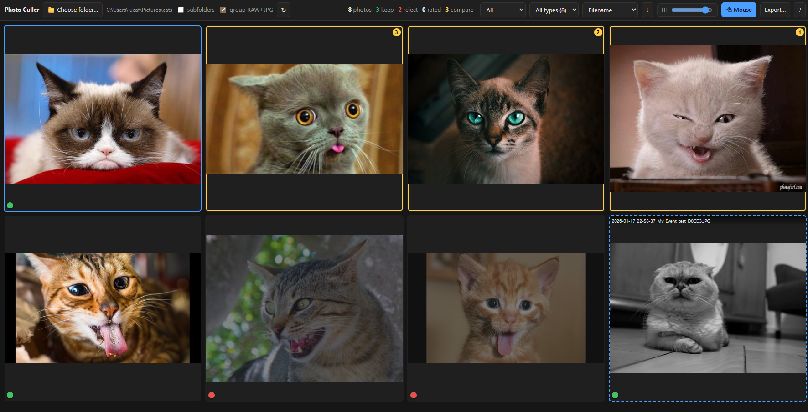
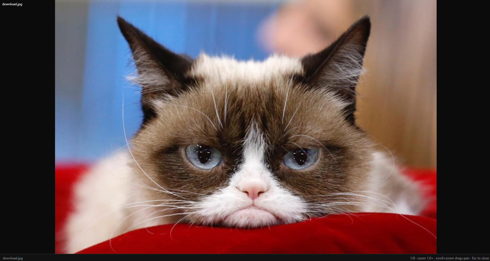
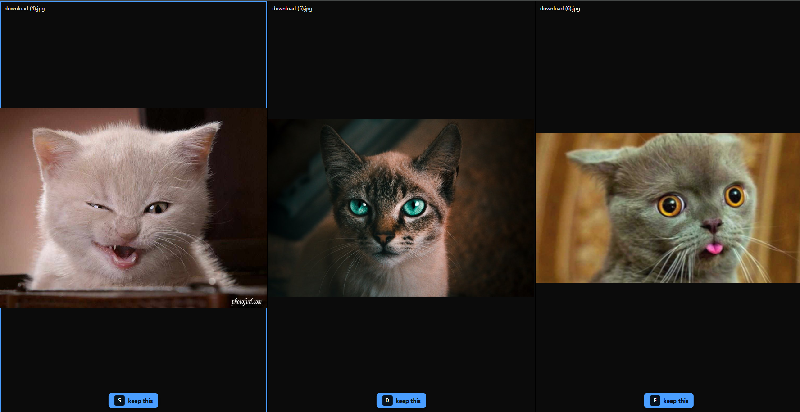

# Photo Culler

A fast, keyboard-driven photo culling tool. Point it at a folder, fly through
your shots, flag keepers and rejects, rate them, compare similar frames
side-by-side with synced zoom, then export the keepers. Your originals stay
untouched until you say otherwise.

It runs as a tiny local web app (Python backend, browser UI). Nothing leaves
your machine.

## Screenshots

<!--
Drop image files in docs/screenshots/ and they'll show up below.
Suggested shots: the grid view, loupe/full view, and compare mode.
-->

| Grid | Loupe | Compare |
| --- | --- | --- |
|  |  |  |

## Features

- **Any folder, optionally recursive.** Scans subfolders too.
- **Wide format support.** JPEG, PNG, WebP, TIFF, GIF, BMP, camera RAW (CR2/CR3,
  NEF, ARW, RAF, RW2, DNG, ORF, and more) and HEIC/HEIF. RAW uses the embedded
  preview for speed.
- **Fast grid** with lazy-loaded, cached thumbnails and an adjustable size
  slider that's remembered between sessions.
- **Flexible sorting** by filename, date taken, date modified, size, or rating.
  Defaults to newest first (filename descending).
- **RAW + JPEG pairing.** A same-named RAW and JPEG in a folder collapse into one
  item, tagged `JPG+RAW`. Marking, comparing, exporting and deleting all act on
  the whole group, so the two files stay in sync. Toggle with the **group
  RAW+JPG** checkbox.
- **Loupe view** with scroll-to-zoom and drag-to-pan.
- **Non-destructive editing** in loupe view: rotate, flip, crop (drag a box),
  and brightness / contrast / saturation / sharpness sliders. Edits live in an
  undo/redo history (`Ctrl+Z` / `Ctrl+Y`), are saved per-photo, and show up as a
  live preview plus a ✎ badge in the grid. Originals on disk are never written,
  so **Reset** fully reverts — until you export, which bakes the edits into the
  output (see below).
- **Compare mode.** Up to 3 images side by side with synchronized zoom and pan:
  zoom one and they all zoom together. Press `S`, `D`, or `F` to keep the best
  and reject the rest in a single tap.
- **Tournament voting.** Select more than 3 and compare runs a binary
  left-vs-right playoff (`←`/`S` vs `→`/`F`). The winner is kept, the rest
  rejected, and the comparison closes itself.
- **Non-destructive marking.** Keep/reject flags and 0-5 star ratings live in a
  local SQLite DB keyed by file path. Re-open the folder and your marks come back.
- **Filters** to view only keepers, rejects, unflagged, or rated photos.
- **Native folder picker.** The **Choose folder...** button opens your OS folder
  dialog, no path typing.
- **Export** copies or moves kept, rejected, or rated photos into a folder
  (defaults to `<photo folder>/cull_output`, optionally preserving subfolder
  structure). Any edits you made are baked into the exported file (an edited
  shot exports as a JPEG with the rotate/crop/tone applied); unedited files are
  copied byte-for-byte. Originals are untouched unless you move. On a move, marks
  follow the files to their new location and the folder is rescanned. An edited
  RAW is never destroyed by a move: the baked JPEG is exported but the original
  RAW is kept in place and the export reports it. Optionally
  **compress JPEGs** on the way out (re-encode at a chosen quality, EXIF kept).
- **Date split.** Move (or copy) photos into date-named subfolders by date taken
  or modified, inside the current folder or a destination you pick.
- **Delete rejected** opens a review grid of every rejected shot with thumbnails.
  Click any to deselect (keep) it, then delete only what's left highlighted. Goes
  to the Recycle Bin when `send2trash` is installed (recoverable); otherwise it's
  a permanent delete.

## Install

Requires Python 3.8 or newer.

```bash
pip install -r requirements.txt
```

> RAW support needs `rawpy` and HEIC needs `pillow-heif`; both ship in
> `requirements.txt`. If a wheel isn't available for your platform the app still
> runs, it just skips that format.

## Run

```bash
python app.py
```

It starts at <http://127.0.0.1:8000> and opens your browser. Click
**📁 Choose folder...** in the top bar to pick a folder; the **↻** button
rescans the current one.

## Keyboard shortcuts

Every shortcut sits under the left hand, centred on the home row using the
**ESDF** nav cluster (index finger on `F`), so you can cull one-handed with the
other on the mouse.

| Key | Action |
| --- | --- |
| `E` `S` `D` `F` (or arrows) | Move selection (up / left / down / right) |
| `Home` / `End` | First / last photo |
| `G` / `Enter` | Open loupe (full) view |
| `Esc` | Back / close |
| `W` | Flag **Keep** (auto-advances) |
| `R` | Flag **Reject** (auto-advances) |
| `Q` | Clear flag |
| `1`-`5` | Star rating · `` ` `` = 0 stars |
| `Ctrl`+`Z` / `Ctrl`+`Y` | Undo / redo edits (loupe) |
| `Space` | Add/remove current photo from the compare set (auto-advances) |
| `C` | Open compare (the compare set, or current + next if none) |
| `S` `D` `F` | In compare (≤3): keep that image, reject the others, close |
| `X` | Clear compare set |
| `T` | Cycle filter |
| `B` | Toggle **mouse mode** |
| `V` / `?` | Show shortcuts |

**In loupe / compare:** scroll (or `E`/`D`) to zoom, drag to pan (synced across
compare panes), `S`/`F` for prev/next (loupe) or to focus a pane (compare), `Z`
or double-click to reset zoom. Marking keys work here too. In a ≤3 compare,
`S`/`D`/`F` pick the keeper; with more than 3 selected, compare becomes a
left-vs-right tournament: vote `←`/`S` (left) or `→`/`F` (right) until one
winner remains. The edit bar is also live in loupe: rotate/flip/crop and the
tone sliders apply to whichever photo is current, with `Ctrl+Z`/`Ctrl+Y` to
undo/redo.

**Mouse mode (`B`):** the photo you hover is semi-selected (dashed outline) and
every hotkey acts on it instead of the keyboard cursor. Hover, tap `E`/`Q`/a
rating, move to the next. There's no auto-advance in this mode since the mouse is
your nav.

## How it stores things

- Marks and last-opened folder: `~/.photo_culler/culler.db` (SQLite).
- Thumbnail/preview cache: `~/.photo_culler/cache/` (safe to delete anytime, it
  regenerates).

## Notes

- RAW orientation relies on the embedded preview's EXIF; in rare cases a RAW may
  appear unrotated.
- The app binds to localhost only.
</content>
</invoke>
